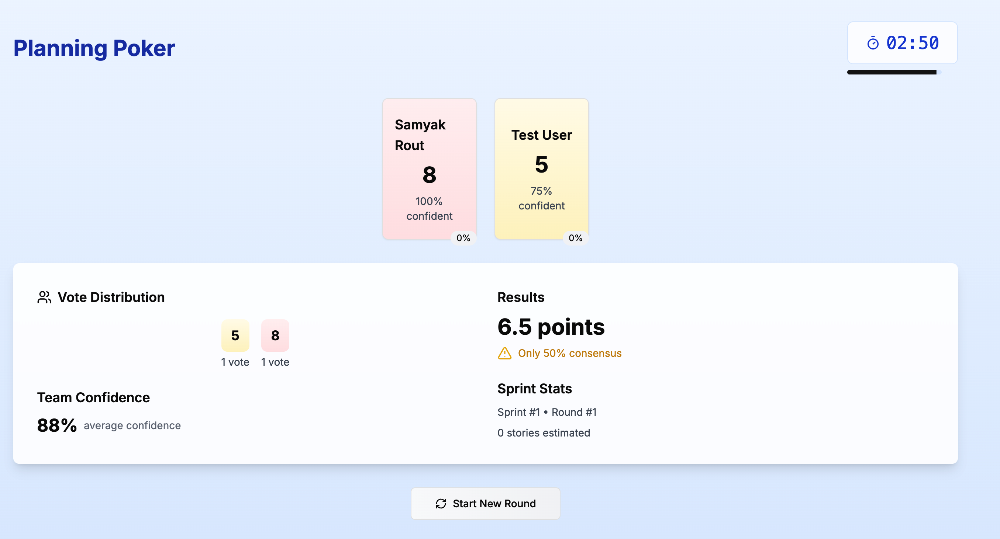

# Planning Poker

A real-time planning poker application for agile teams with a modern, responsive interface and robust features.



## Features

- 🎮 Real-time voting system with confidence indicators
- ⏱️ Configurable timer for voting sessions
- 👥 Support for multiple players with take-over functionality
- 📊 Detailed voting statistics and consensus tracking
- 🎯 Confidence level indicators for each vote
- 📈 Sprint and story point history tracking
- 🌓 Dark mode support
- 🔄 Automatic state synchronization
- 🚀 Optimized for performance
- 📱 Fully responsive design

## Tech Stack

- **Framework**: Next.js 13 with App Router
- **State Management**: Zustand
- **Data Storage**: Redis
- **Styling**: Tailwind CSS + shadcn/ui
- **Animations**: Framer Motion
- **Testing**: Vitest + React Testing Library + Playwright
- **Deployment**: Docker + Kubernetes + Kargo
- **Environment**: Configurable through environment variables

## Prerequisites

- Node.js 20.x or later
- npm 9.x or later
- Redis 6.x or later
- Docker (optional, for containerized deployment)

## Local Development Setup

### 1. Install Redis Locally

**Ubuntu/Debian**:
```bash
# Update package list
sudo apt update

# Install Redis
sudo apt install redis-server

# Start Redis service
sudo systemctl start redis-server

# Enable Redis to start on boot
sudo systemctl enable redis-server

# Verify Redis is running
redis-cli ping
# Should return "PONG"
```

**macOS**:
```bash
# Install Redis using Homebrew
brew install redis

# Start Redis service
brew services start redis

# Verify Redis is running
redis-cli ping
# Should return "PONG"
```

**Windows**:
```bash
# Using Windows Subsystem for Linux (WSL2) - Recommended
wsl --install
wsl sudo apt update
wsl sudo apt install redis-server
wsl sudo service redis-server start

# Verify Redis is running
wsl redis-cli ping
# Should return "PONG"
```

### 2. Application Setup

1. Clone the repository:
   ```bash
   git clone https://github.com/your-org/planning-poker.git
   cd planning-poker
   ```

2. Install dependencies:
   ```bash
   npm install
   ```

3. Copy the environment file:
   ```bash
   cp .env.example .env
   ```

4. Configure local Redis in `.env`:
   ```env
   # Application
   NEXT_PUBLIC_APP_URL=http://localhost:3000
   NEXT_PUBLIC_APP_NAME=Planning Poker
   NEXT_PUBLIC_APP_DESCRIPTION=A real-time planning poker application for agile teams
   NEXT_PUBLIC_API_URL=http://localhost:3000/api
   
   # Redis Local Configuration
   REDIS_HOST=localhost
   REDIS_PORT=6379
   REDIS_PASSWORD=
   REDIS_SSL=false
   ```

### 3. Development Workflow

1. Start Redis (if not running):
   ```bash
   # Ubuntu/Debian/WSL
   sudo service redis-server start
   
   # macOS
   brew services start redis
   ```

2. Verify Redis connection:
   ```bash
   redis-cli
   127.0.0.1:6379> ping
   PONG
   127.0.0.1:6379> exit
   ```

3. Run the development server:
   ```bash
   npm run dev
   ```

4. Run tests:
   ```bash
   # Unit tests in watch mode
   npm run test
   
   # Unit tests with coverage
   npm run test:coverage
   
   # E2E tests
   npm run test:e2e
   
   # Smoke tests only
   npm run test:smoke
   ```

5. Build for production:
   ```bash
   npm run build
   ```

6. Start production server:
   ```bash
   npm run start
   ```

### 4. Redis Management

Monitor Redis:
```bash
# Monitor all Redis commands
redis-cli monitor

# Check Redis info
redis-cli info

# Clear all data
redis-cli flushall
```

Redis configuration file locations:
- Ubuntu/Debian: `/etc/redis/redis.conf`
- macOS: `/usr/local/etc/redis.conf`
- WSL: `/etc/redis/redis.conf`

### Alternative Redis Setups

1. **Azure Cache for Redis**:
   - Create an Azure Cache for Redis instance
   - Get connection details from Azure Portal
   - Update environment variables:
     ```env
     REDIS_HOST=your-instance.redis.cache.windows.net
     REDIS_PORT=6380
     REDIS_PASSWORD=your_access_key
     REDIS_SSL=true
     ```

2. **Docker Redis**:
   ```bash
   # Start Redis container
   docker run --name redis -p 6379:6379 -d redis:alpine
   
   # Monitor Redis logs
   docker logs -f redis
   
   # Connect to Redis CLI
   docker exec -it redis redis-cli
   ```

3. **Docker Compose**:
   ```bash
   # Start Redis with Docker Compose
   docker-compose up redis
   ```

## Deployment

See [DOCKER.md](DOCKER.md) for detailed container deployment instructions.

### Kubernetes Deployment

1. Apply Kubernetes manifests:
   ```bash
   kubectl apply -k k8s/overlays/production
   ```

2. Deploy using Helm:
   ```bash
   helm install planning-poker ./helm/planning-poker \
     --set redis.host=your-redis-host \
     --set redis.password=your-redis-password
   ```

### Monitoring

- Prometheus metrics available at `/metrics`
- Grafana dashboards included in Helm chart
- Health check endpoint at `/health`

## Environment Variables

| Variable | Description | Default |
|----------|-------------|---------|
| `NEXT_PUBLIC_APP_URL` | Application URL | http://localhost:3000 |
| `NEXT_PUBLIC_APP_NAME` | Application name | Planning Poker |
| `NEXT_PUBLIC_APP_DESCRIPTION` | Application description | A real-time planning poker application... |
| `NEXT_PUBLIC_API_URL` | API endpoint | http://localhost:3000/api |
| `NEXT_PUBLIC_AUTH_ENABLED` | Enable authentication | false |
| `NEXT_PUBLIC_ENABLE_DARK_MODE` | Enable dark mode | true |
| `NEXT_PUBLIC_ENABLE_ANALYTICS` | Enable analytics | false |
| `REDIS_HOST` | Redis host | localhost |
| `REDIS_PORT` | Redis port | 6379 |
| `REDIS_PASSWORD` | Redis password | - |
| `REDIS_SSL` | Enable Redis SSL | false |

## Contributing

1. Fork the repository
2. Create your feature branch (`git checkout -b feature/amazing-feature`)
3. Commit your changes (`git commit -m 'Add amazing feature'`)
4. Push to the branch (`git push origin feature/amazing-feature`)
5. Open a Pull Request

## License